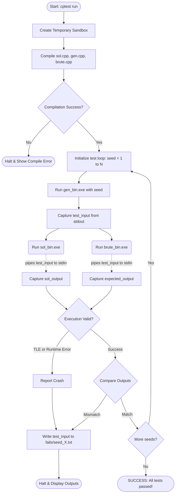

# CP Stress-Testing CLI Tool (`cptest`)


A robust, system-level CLI tool designed for competitive programmers to automate the discovery of edge cases and failing tests in algorithmic solutions. 

By orchestrating isolated C++ compilation and inter-process communication (IPC) via standard I/O piping, `cptest` rapidly fires thousands of random test cases at a fast (but potentially buggy) solution, comparing its output against a slow, undeniably correct brute-force reference.

## ✨ Features

- **Automated Bug Discovery:** Instantly finds the exact small input that breaks your logic, saving hours of manual dry-running during live contests.
- **Process Isolation & Safety:** Uses Python's `subprocess` engine to enforce strict Time Limit Exceeded (TLE) constraints (default 2s) and intercept Runtime Errors (like segfaults) cleanly without crashing the tool.
- **Invisible File Handling:** Zero file I/O boilerplate required in your C++ code. The tool pipelines the generator's `stdout` directly into the `stdin` of your solutions in memory.
- **Smart Output Matching:** Automatically strips trailing whitespaces and trailing blank lines to prevent frustrating formatting-based false negatives.
- **Special-Judge Checker Protocol:** Write complex custom validation logic (e.g., graph traversal, floating-point validation) effortlessly in Python or C++.
- **Artifact Saving:** Upon finding a failure, the exact input array is instantly saved to a `fails/` directory for local debugging.

---

## 🚀 Installation & Setup (For Beginners)

If you just found this project and want to use it on your own computer, follow these exact steps:

### Step 1: Download the Project
1. Click the green **Code** button at the top of this GitHub repository and select **Download ZIP**.
2. Extract the downloaded ZIP file to an easily accessible folder (e.g., `Desktop\cptest-main`).

### Step 2: Install Prerequisites
Before you can use `cptest`, you must have two things installed on your computer:
1. **Python (3.7+)**: Download and install it from [python.org](https://www.python.org/downloads/). Make sure to check the box that says "Add Python to PATH" during installation.
2. **C++ Compiler (g++)**: You need a working C++ compiler. A common choice for Windows is [MinGW-w64](https://www.msys2.org/). Ensure that `g++` is added to your system's Environment Variables (`PATH`).

### Step 3: Install the `cptest` Engine
1. Open your terminal (Command Prompt or PowerShell).
2. Use the `cd` command to navigate inside the inner `cp-stress-tester` folder where the Python package lives.
```bash
cd C:\path\to\your\extracted\folder\cp-stress-tester
```
3. Run the following command to globally install the tool:
```bash
python -m pip install -e .
```
*(This installs the engine in "editable" mode, meaning any changes you make to the tool's python files will instantly take effect without needing to reinstall).*

---

## 📖 How to Use the Stress Tester

Once installed, you can use the tool from **any folder on your computer**! 

### Step 1: Prepare Your Files
Create a new folder anywhere (e.g., `Desktop\my_contest`). Inside that folder, create these three C++ files:
1. **`gen.cpp` (Generator):** This file must generate exactly **1 random test case** to `cout`. (Do not use `while(t--)` for multiple test cases; the engine handles looping automatically).
2. **`sol.cpp` (Your Solution):** Your fast, optimized code that you want to test.
3. **`brute.cpp` (Reference):** Your slow, naive, but 100% mathematically correct code (like an O(N^2) loop).

### Step 2: Run the Engine
Open your terminal inside that folder and run:
```bash
python -m cptest.cli run --sol sol.cpp --brute brute.cpp --gen gen.cpp
```

### Step 3: View Results
- **If it passes:** It will run 100 random arrays and show a green `[SUCCESS] All 100 iterations passed!`.
- **If it fails:** It instantly halts, saves the exact failing array to a `fails/` folder, and prints the input alongside the Expected Answer and Actual Answer for immediate debugging!

## 🔄 Working Flow & Architecture

The tool abstracts away the pain of file management, compilation, and string comparison. Below is the complete lifecycle of a single stress-test command:



### 🏗️ Under the Hood
1. **Compilation Sandbox:** Uses Python's `tempfile.TemporaryDirectory()` to compile `.exe` binaries. This ensures your workspace remains unpolluted by `.exe` files and `.obj` build artifacts.
2. **Execution Engine (`runner.py`):** Utilizes `subprocess.run(capture_output=True, timeout=X)` to launch the compiled C++ binaries. Standard streams (`stdin`/`stdout`) are safely and securely piped in RAM.
3. **Argparse CLI (`cli.py`):** Exposes customizable flags allowing you to dynamically adjust iterations (`--iters`), timeout limits (`--timeout`), and deterministic starting seeds (`--seed-start`).

---

## 🛠️ Advanced: Special-Judge Checkers

If a problem has multiple valid configurations (e.g., "output any valid path in a graph"), an exact string match against a brute force will fail. Instead of `--brute`, you can provide a custom `--checker` (written in `.cpp` or `.py`):

```bash
python -m cptest.cli run --sol sol.cpp --gen gen.cpp --checker checker.py
```

**Checker Protocol:** 
The tool passes temporary file paths to your checker via command line arguments in this exact order: 
`checker <input_file> <sol_output_file> [<brute_output_file>]`

Your checker script should parse these files. If the solution is correct, exit with code `0`. Any non-zero exit code triggers a failure, and `cptest` will forward whatever your checker printed to `stdout`/`stderr` directly to the user as the explanation.

---

## 💡 Why this exists (Related Tools)

While tools like `quicktest`, `CP Editor` built-ins, and bash scripts exist, `cptest` was designed with a specific angle: **a seamless Python-based checker plugin system**. Writing complex validation logic (like graph cycles or float tolerances) in C++ during a live contest is slow and error-prone. By allowing checkers to be written natively in Python, validation scripts can be built in a fraction of the time. It also features automatic `fails/` directory organization natively.

---

## ⚠️ Known Limitations (v1.0)
- **No Floating-Point Tolerance:** Exact output matching currently does not support dynamic floating-point tolerance (e.g., `1.000` != `1.0`). Use a custom Python checker for float problems.
- **Language Support:** v1 currently only officially supports C++ for the `sol`, `gen`, and `brute` files.
- **Single-Threaded:** The test loop is currently sequential, running one seed at a time.

